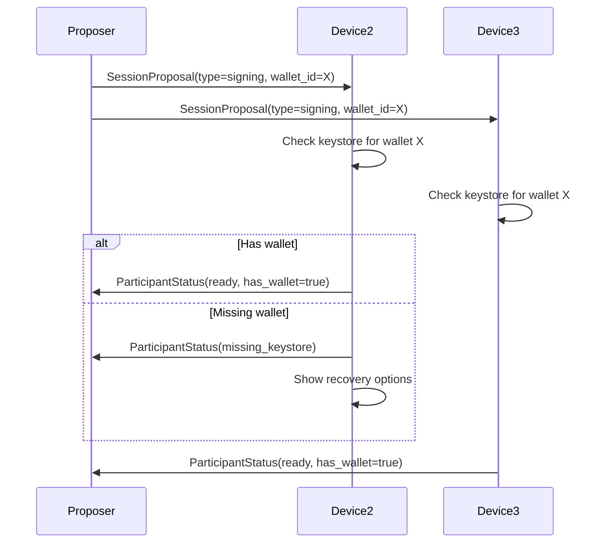
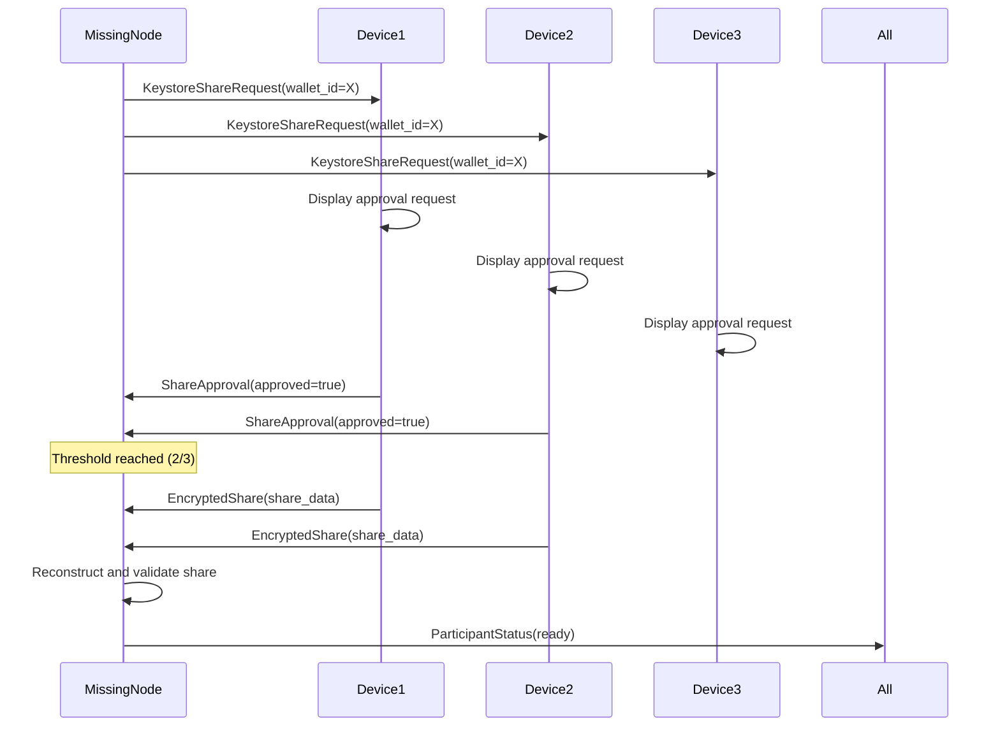

# Keystore Session Protocol Specification

## 1. Session State Machine

### 1.1 Session Types

```rust
enum SessionType {
    DKG,                    // Distributed Key Generation
    Signing { wallet_id: String },  // Transaction signing with existing keys
}
```

### 1.2 Participant States

```rust
enum ParticipantState {
    // Initial states
    Invited,                
    CheckingKeystore,
    
    // Ready states  
    Ready { keystore_status: KeystoreStatus },
    
    // Error states
    MissingKeystore { wallet_id: String },
    KeystoreMismatch { reason: String },
    
    // Recovery states
    RequestingShare,
    ImportingKeystore,
    
    // Final states
    Active,
    Failed { reason: String },
    Declined,
}
```

### 1.3 Keystore Status

```rust
struct KeystoreStatus {
    has_wallet: bool,
    wallet_valid: bool,
    identifier: Option<Identifier>,
    threshold_match: bool,
    participant_match: bool,
}
```

## 2. Message Flow

### 2.1 Signing Session Initialization



### 2.2 Keystore Recovery Flow



## 3. Protocol Messages

### 3.1 Extended SessionProposal

```rust
#[derive(Serialize, Deserialize)]
struct SessionProposal {
    // Base fields
    session_id: String,
    proposer: String,
    total: u16,
    threshold: u16,
    participants: Vec<String>,
    
    // Extension for keystore sessions
    session_type: SessionType,
    
    // Validation data for signing sessions
    #[serde(skip_serializing_if = "Option::is_none")]
    wallet_metadata: Option<WalletMetadata>,
}

#[derive(Serialize, Deserialize)]
struct WalletMetadata {
    wallet_id: String,
    group_public_key: String,
    curve_type: String,
    blockchain: String,
}
```

### 3.2 ParticipantStatus

```rust
#[derive(Serialize, Deserialize)]
struct ParticipantStatus {
    session_id: String,
    device_id: String,
    state: ParticipantState,
    keystore_status: Option<KeystoreStatus>,
    timestamp: u64,
}
```

### 3.3 Share Request/Response

```rust
#[derive(Serialize, Deserialize)]
struct KeystoreShareRequest {
    session_id: String,
    requesting_device: String,
    wallet_id: String,
    reason: ShareRequestReason,
    device_public_key: String,  // For encrypting response
}

#[derive(Serialize, Deserialize)]
enum ShareRequestReason {
    MissingKeystore,
    CorruptedKeystore,
    DeviceReplacement,
}

#[derive(Serialize, Deserialize)]
struct ShareApproval {
    session_id: String,
    approving_device: String,
    request_id: String,
    approved: bool,
    reason: Option<String>,
}

#[derive(Serialize, Deserialize)]
struct EncryptedShare {
    session_id: String,
    from_device: String,
    to_device: String,
    encrypted_data: Vec<u8>,  // Encrypted with recipient's public key
    share_proof: ShareProof,
}

#[derive(Serialize, Deserialize)]
struct ShareProof {
    identifier: Identifier,
    commitment: String,
    group_public_key: String,
}
```

## 4. State Transitions

### 4.1 Session Proposer State Machine

```
[Initial] -> [WaitingForResponses] -> [CheckingThreshold] -> [Active/Failed]
                     |
                     v
              [HandlingRecovery] -> [WaitingForRecovery] -> [CheckingThreshold]
```

### 4.2 Participant State Machine

```
[Invited] -> [CheckingKeystore] -> [Ready] -> [Active]
                |                      ^
                v                      |
        [MissingKeystore] -> [Recovery] 
                |              |
                v              v
           [Declined]    [ImportSuccess]
```

## 5. Implementation Details

### 5.1 Session Command Extensions

```rust
// Extend the propose command
pub fn handle_propose_command(cmd: &str) -> Result<SessionProposal> {
    let parts: Vec<&str> = cmd.split_whitespace().collect();
    
    // Format: /propose <id> <total> <threshold> <devices> [--wallet <wallet_id>]
    if parts.len() < 5 {
        return Err("Invalid propose format");
    }
    
    let session_type = if let Some(wallet_idx) = parts.iter().position(|&p| p == "--wallet") {
        if let Some(wallet_id) = parts.get(wallet_idx + 1) {
            // Load wallet metadata for validation
            let wallet_metadata = load_wallet_metadata(wallet_id)?;
            SessionType::Signing { 
                wallet_id: wallet_id.to_string() 
            }
        } else {
            return Err("Missing wallet ID after --wallet");
        }
    } else {
        SessionType::DKG
    };
    
    // ... rest of parsing
}
```

### 5.2 Keystore Validation

```rust
impl AppState {
    async fn validate_keystore_for_session(
        &self, 
        proposal: &SessionProposal
    ) -> KeystoreStatus {
        match &proposal.session_type {
            SessionType::DKG => {
                // DKG sessions don't require existing keystore
                KeystoreStatus {
                    has_wallet: false,
                    wallet_valid: true,
                    identifier: None,
                    threshold_match: true,
                    participant_match: true,
                }
            }
            SessionType::Signing { wallet_id } => {
                // Check if wallet exists
                let keystore = self.keystore.as_ref()?;
                let wallet = keystore.get_wallet(wallet_id)?;
                
                // Validate parameters
                let threshold_match = wallet.threshold == proposal.threshold;
                let participant_match = wallet.total_participants == proposal.total;
                
                KeystoreStatus {
                    has_wallet: true,
                    wallet_valid: threshold_match && participant_match,
                    identifier: Some(self.identifier),
                    threshold_match,
                    participant_match,
                }
            }
        }
    }
}
```

### 5.3 Recovery Handler

```rust
pub async fn handle_missing_keystore(
    state: &Arc<Mutex<AppState>>,
    session_id: String,
    wallet_id: String,
) -> Result<()> {
    // Show recovery options
    let options = vec![
        "Request share from other participants",
        "Import from backup file", 
        "Join as observer only",
        "Decline session"
    ];
    
    match show_selection_popup(options).await? {
        0 => initiate_share_request(state, session_id, wallet_id).await,
        1 => show_import_dialog(state, wallet_id).await,
        2 => join_as_observer(state, session_id).await,
        3 => decline_session(state, session_id).await,
        _ => unreachable!()
    }
}
```

## 6. Security Protocols

### 6.1 Share Encryption

```rust
fn encrypt_share_for_device(
    share_data: &[u8],
    recipient_public_key: &PublicKey,
    sender_private_key: &PrivateKey,
) -> Result<EncryptedShare> {
    // Use ECIES for encryption
    let ephemeral_key = generate_ephemeral_key();
    let shared_secret = ecdh(ephemeral_key, recipient_public_key);
    let encrypted = aes_gcm_encrypt(share_data, &shared_secret)?;
    
    // Sign the encrypted data
    let signature = sign(&encrypted, sender_private_key)?;
    
    Ok(EncryptedShare {
        encrypted_data: encrypted,
        ephemeral_public_key: ephemeral_key.public_key(),
        signature,
    })
}
```

### 6.2 Share Validation

```rust
fn validate_received_share(
    share: &EncryptedShare,
    expected_wallet: &WalletMetadata,
) -> Result<bool> {
    // Decrypt share
    let decrypted = decrypt_share(&share)?;
    
    // Parse key package
    let key_package: KeyPackage = serde_json::from_slice(&decrypted)?;
    
    // Verify against group public key
    let computed_public = compute_public_share(&key_package);
    let expected_public = PublicKey::from_hex(&expected_wallet.group_public_key)?;
    
    Ok(computed_public == expected_public)
}
```

## 7. Error Handling Matrix

| Error Condition | Recovery Options | Auto-Recovery | User Action Required |
|----------------|------------------|---------------|---------------------|
| Missing Keystore | Request share, Import, Join as observer | No | Yes |
| Corrupted Keystore | Restore backup, Request share | Check backups | Yes |
| Wrong Wallet Version | Re-import, Update | No | Yes |
| Threshold Mismatch | Cannot proceed | No | Select correct wallet |
| Network Failure | Retry, Continue with available | Yes (retry) | Monitor |
| Share Request Denied | Try different participants | No | Yes |

## 8. Backwards Compatibility

The protocol maintains backwards compatibility by:

1. **Optional Fields**: `session_type` and `wallet_metadata` are optional
2. **Default Behavior**: Missing fields default to DKG session type
3. **Version Negotiation**: Devices advertise supported protocol versions
4. **Graceful Degradation**: Newer devices can participate in legacy sessions