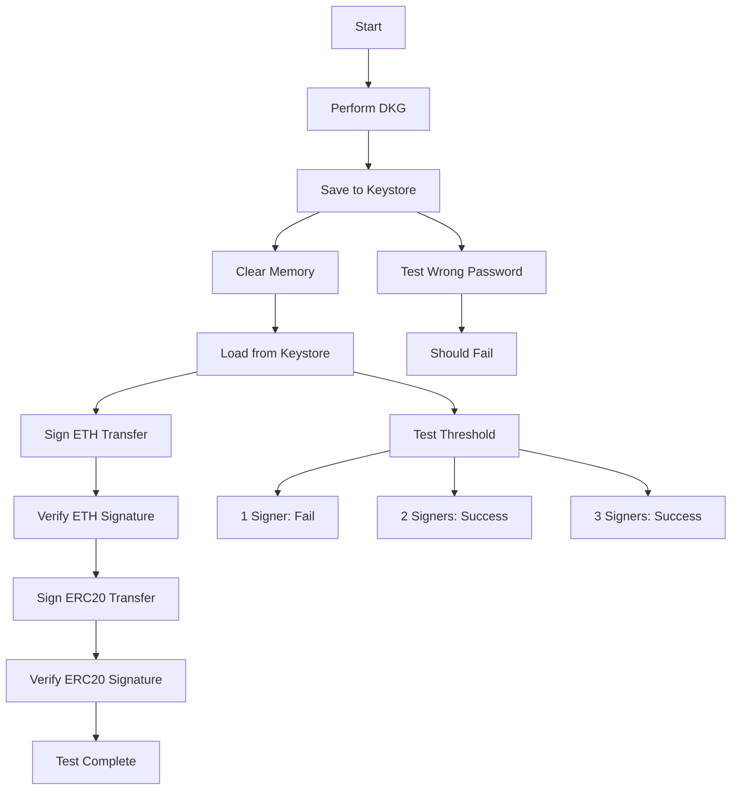

# Keystore End-to-End Test Plan

## Overview

This document outlines the comprehensive E2E test for keystore functionality, including:
- Wallet persistence (save/load)
- Multiple transaction types (ETH, ERC20)
- Signature verification
- Security validation

## Test Scenarios

### 🔐 Phase 1: Wallet Creation and Persistence

#### 1.1 DKG with Keystore Save
```
Participants: P1 (Coordinator), P2, P3
Threshold: 2-of-3
Curve: secp256k1
```

**Steps:**
1. Perform complete DKG ceremony
2. Encrypt key shares with password
3. Save to keystore files:
   - `keystore_p1.json` - P1's encrypted share
   - `keystore_p2.json` - P2's encrypted share  
   - `keystore_p3.json` - P3's encrypted share
4. Verify files are created and encrypted

#### 1.2 Keystore Format
```json
{
  "version": "1.0",
  "id": "uuid-v4",
  "address": "0x...",
  "crypto": {
    "cipher": "aes-256-gcm",
    "cipherparams": {
      "iv": "hex",
      "tag": "hex"
    },
    "ciphertext": "hex-encrypted-key-package",
    "kdf": "pbkdf2",
    "kdfparams": {
      "c": 262144,
      "dklen": 32,
      "prf": "hmac-sha256",
      "salt": "hex"
    }
  },
  "frost": {
    "threshold": 2,
    "total_participants": 3,
    "participant_id": 1,
    "group_public_key": "hex",
    "curve": "secp256k1"
  }
}
```

### 🔑 Phase 2: Wallet Loading

#### 2.1 Load from Keystore
**Steps:**
1. Clear all in-memory state
2. Load keystore files
3. Decrypt with password
4. Reconstruct FROST key packages
5. Verify loaded wallet matches original

#### 2.2 Validation Checks
- ✅ Correct participant ID
- ✅ Same group public key
- ✅ Same threshold parameters
- ✅ Can derive same Ethereum address

### 💰 Phase 3: ETH Transfer Signing

#### 3.1 Transaction Creation
```typescript
{
  to: "0x742d35Cc6634C0532925a3b844Bc9e7595f0bEb7",
  value: "1.5 ETH",
  gasPrice: "20 gwei",
  gasLimit: 21000,
  nonce: 42,
  chainId: 1
}
```

#### 3.2 Signing with Loaded Wallet
**Steps:**
1. Load wallets for P1 and P2
2. Create signing session
3. Generate signature shares
4. Aggregate to final signature
5. Verify signature is valid

### 🪙 Phase 4: ERC20 Transfer Signing

#### 4.1 ERC20 Transaction Structure
```typescript
{
  to: "0xA0b86991c6218b36c1d19D4a2e9Eb0cE3606eB48", // USDC Contract
  data: "0xa9059cbb" + // transfer(address,uint256) selector
        "000000000000000000000000742d35cc6634c0532925a3b844bc9e7595f0beb7" + // recipient
        "00000000000000000000000000000000000000000000000000000000000f4240", // amount (1,000,000)
  gasPrice: "30 gwei",
  gasLimit: 65000,
  nonce: 43,
  chainId: 1
}
```

#### 4.2 ERC20-Specific Validation
- ✅ Correct function selector (0xa9059cbb for transfer)
- ✅ Proper parameter encoding
- ✅ Valid signature for contract interaction
- ✅ Gas estimation appropriate for ERC20

### 🔍 Phase 5: Signature Verification

#### 5.1 Verification Methods
1. **FROST Verification**: Verify against group public key
2. **Ethereum Recovery**: Attempt ecrecover (with format conversion)
3. **Transaction Hash**: Verify correct message was signed

#### 5.2 Security Assertions
- ❌ Cannot sign with only 1 participant (below threshold)
- ❌ Cannot load keystore with wrong password
- ❌ Cannot modify keystore without detection
- ✅ Can sign with any 2 participants
- ✅ All signatures are deterministic for same message

## Test Workflow



## Implementation Files

### Core Components
1. `keystore_manager.rs` - Encryption/decryption logic
2. `erc20_encoder.rs` - ERC20 transaction encoding
3. `keystore_e2e_test.rs` - Complete E2E test
4. `signature_verifier.rs` - Multi-method verification

### Test Data
- Standard ERC20 ABI for encoding
- Test passwords for encryption
- Known test vectors for verification

## Success Criteria

1. **Persistence**: Wallet survives application restart
2. **Security**: Encrypted storage with strong KDF
3. **Compatibility**: Works with standard Ethereum tools
4. **Flexibility**: Can sign multiple transaction types
5. **Reliability**: Deterministic signatures
6. **Threshold**: Proper t-of-n security model

## Error Scenarios to Test

1. Wrong password on load
2. Corrupted keystore file
3. Missing participant for threshold
4. Invalid transaction data
5. Wrong chain ID
6. Insufficient gas
7. Malformed ERC20 data

## Expected Outputs

### Successful Test Run
```
✅ DKG completed - 3 participants
✅ Keystores saved - 3 files created
✅ Memory cleared - State reset
✅ Keystores loaded - 3 wallets restored
✅ ETH transfer signed - 2-of-3 threshold
✅ ETH signature verified
✅ ERC20 transfer signed - 2-of-3 threshold
✅ ERC20 signature verified
✅ Wrong password rejected
✅ Single signer rejected (below threshold)
✅ All security checks passed

Test Summary: 11/11 passed
```

## Notes

- Use deterministic test vectors where possible
- Ensure cleanup of test keystore files
- Test both online and offline signing flows
- Validate against real Ethereum contracts on testnet if possible