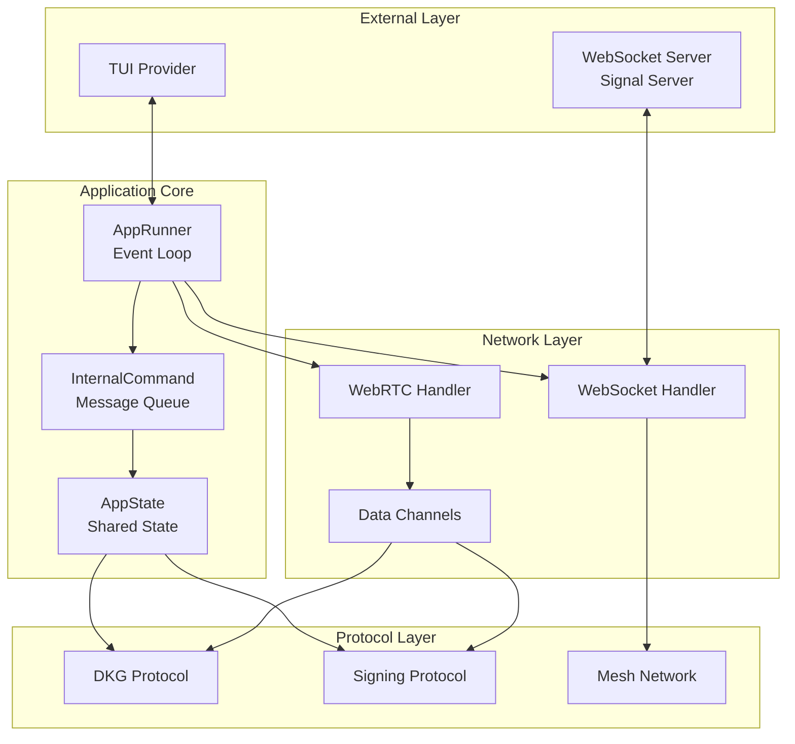
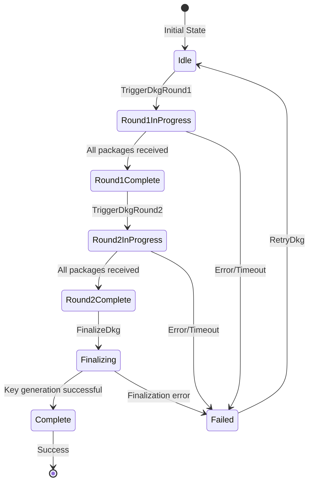
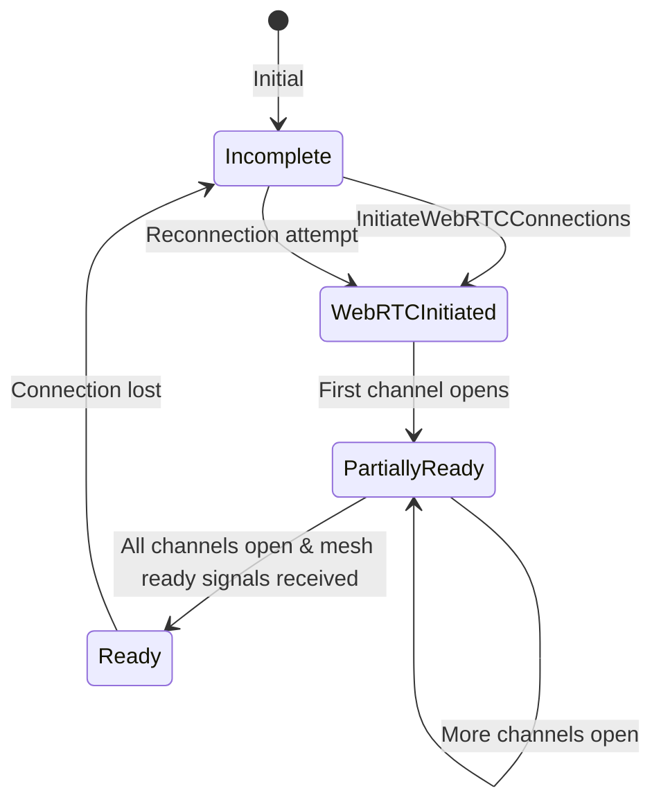
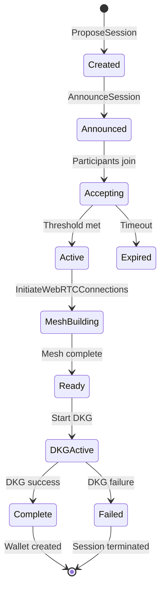
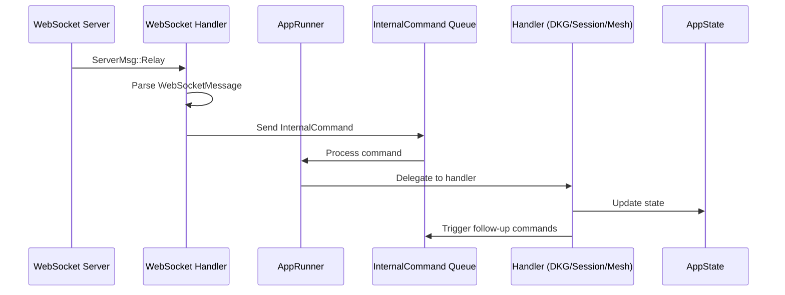
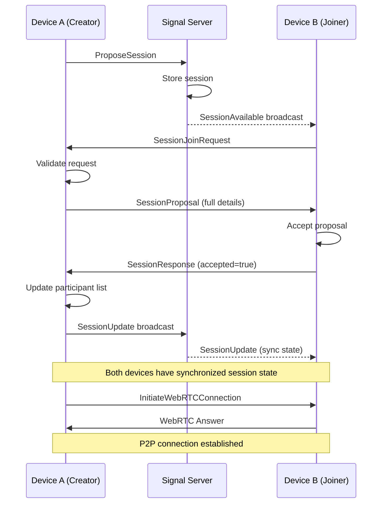
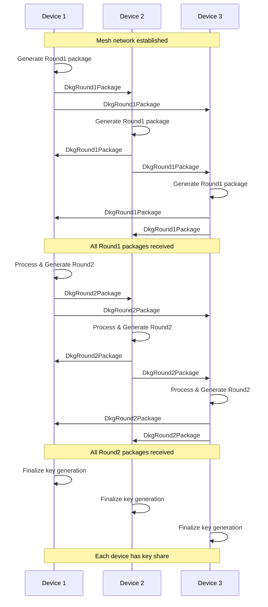

# MPC Wallet TUI Node - Technical Architecture Documentation

## Executive Summary

The MPC Wallet TUI Node is a distributed system implementing threshold signature schemes using FROST (Flexible Round-Optimized Schnorr Threshold) protocol. The architecture follows an event-driven, state machine pattern with WebSocket/WebRTC communication for P2P coordination between nodes. This document provides comprehensive analysis of the state transitions, message flows, and critical architectural patterns.

## Table of Contents

1. [System Architecture Overview](#system-architecture-overview)
2. [State Machine Architecture](#state-machine-architecture)
3. [Message Flow Architecture](#message-flow-architecture)
4. [Critical Issues and Fixes](#critical-issues-and-fixes)
5. [Architectural Recommendations](#architectural-recommendations)

---

## System Architecture Overview

### Core Components



### Key Design Patterns

1. **Event-Driven Architecture**: All state changes triggered by `InternalCommand` enum variants
2. **Actor Model**: Components communicate via message passing through `mpsc::UnboundedSender<InternalCommand<C>>`
3. **Shared State**: `Arc<Mutex<AppState<C>>>` provides thread-safe state access
4. **Command Pattern**: Each operation encapsulated as an `InternalCommand` variant

---

## State Machine Architecture

### 1. DKG State Machine

The Distributed Key Generation state machine manages the multi-party computation protocol for generating threshold keys.



#### State Definitions

```rust
pub enum DkgState {
    Idle,                // No DKG in progress
    Round1InProgress,    // Generating and exchanging commitments
    Round1Complete,      // All Round 1 packages received
    Round2InProgress,    // Generating and exchanging shares
    Round2Complete,      // All Round 2 packages received
    Finalizing,          // Computing final key shares
    Complete,            // DKG successful, keys generated
    Failed(String),      // DKG failed with reason
}
```

#### State Transition Guards

- **Idle → Round1InProgress**: Requires:
  - `MeshStatus::Ready` (all P2P connections established)
  - `identifier_map.is_some()` (participant identifiers assigned)
  - `session.is_some()` (active session exists)
  - Session type is DKG
  - Participant count equals session total

- **Round1InProgress → Round1Complete**: Automatic when:
  - `received_dkg_packages.len() == session.participants.len()`

- **Round1Complete → Round2InProgress**: Triggered by:
  - `InternalCommand::TriggerDkgRound2`

- **Round2InProgress → Round2Complete**: Automatic when:
  - `received_dkg_round2_packages.len() == session.participants.len()`

### 2. Mesh Network State Machine

The mesh network manages P2P WebRTC connections between all participants.



#### State Definitions

```rust
pub enum MeshStatus {
    Incomplete,                           // No connections established
    WebRTCInitiated,                      // Connection process started
    PartiallyReady {                      // Some connections established
        ready_devices: HashSet<String>,
        total_devices: usize,
    },
    Ready,                                // Full mesh network ready
}
```

#### Critical Mesh Readiness Logic

The mesh becomes ready when:
1. All required participants have joined (`participants.len() == session.total`)
2. All participants have accepted the session
3. WebRTC data channels are open to all other participants
4. All participants have sent `MeshReady` signals

### 3. Session State Lifecycle

Sessions manage the participant coordination and agreement protocol.



#### Session State Synchronization

Sessions maintain synchronized state through:
- **SessionProposal**: Initial session configuration broadcast
- **SessionResponse**: Accept/reject responses from participants
- **SessionUpdate**: Real-time participant list synchronization
- **SessionJoinRequest**: Late join/rejoin requests

---

## Message Flow Architecture

### 1. External to Internal Message Flow



### 2. Message Type Hierarchy

```
ServerMsg (WebSocket layer)
├── Devices: Online device list
├── Relay: P2P message relay
│   └── WebSocketMessage (Application layer)
│       ├── SessionProposal
│       ├── SessionResponse
│       ├── SessionUpdate
│       ├── SessionJoinRequest
│       └── WebRTCSignal
│           ├── Offer
│           ├── Answer
│           └── Candidate
├── SessionAvailable: Discovery announcement
├── SessionsForDevice: Active sessions query
└── SessionRemoved: Session termination

WebRTCMessage (Data channel layer)
├── ChannelOpen: Connection established
├── MeshReady: Participant ready signal
├── DkgRound1Package: Commitment exchange
├── DkgRound2Package: Share exchange
├── SigningRequest: Transaction signing
├── SigningCommitment: FROST Round 1
└── SignatureShare: FROST Round 2
```

### 3. Command Dispatch Pattern

```rust
// External message triggers internal command
WebSocketMessage::SessionProposal(proposal) => {
    InternalCommand::ProcessSessionProposal { proposal }
}

// Internal command updates state and triggers follow-up
InternalCommand::AcceptSessionProposal(id) => {
    1. Update session state
    2. Send SessionResponse via WebSocket
    3. Trigger InternalCommand::InitiateWebRTCConnections
}

// Follow-up command continues the flow
InternalCommand::InitiateWebRTCConnections => {
    1. Create P2P connections
    2. Open data channels
    3. Trigger InternalCommand::ReportChannelOpen per connection
}
```

### 4. Critical Message Flows

#### A. Session Creation and Join Flow



#### B. DKG Protocol Flow



---

## Critical Issues and Fixes

### Issue 1: Premature DKG Start Bug

**Problem**: DKG was starting with insufficient participants (2/3 instead of 3/3).

**Root Cause**: In `mesh_commands.rs`, the check was using current participant count instead of required total:
```rust
// BUG: Checking current count
if current_count < total_needed {
    // Buffer signal
}
```

**Fix Applied**: Check both participant count AND acceptance status:
```rust
// FIXED: Check both conditions
if current_count < total_needed {
    state_guard.pending_mesh_ready_signals.push(device_id.clone());
    return; // Don't proceed
}

if accepted_count < total_needed {
    state_guard.pending_mesh_ready_signals.push(device_id.clone());
    return; // Don't proceed
}
```

### Issue 2: Session State Desynchronization

**Problem**: Participants list and accepted_devices list becoming inconsistent.

**Root Cause**: Multiple code paths updating these lists independently:
- `SessionProposal` updates participants
- `SessionResponse` updates accepted_devices
- `SessionUpdate` should sync both but only updated accepted_devices

**Fix Applied**: Ensure both lists stay synchronized:
```rust
// In SessionUpdate handler
session.accepted_devices = update.accepted_devices.clone();
session.participants = update.accepted_devices.clone(); // Keep in sync
```

### Issue 3: Race Condition in WebRTC Initiation

**Problem**: Multiple simultaneous `InitiateWebRTCConnections` causing duplicate connections.

**Root Cause**: No debouncing or state tracking for ongoing initiation.

**Fix Applied**: Added initiation tracking:
```rust
pub struct AppState<C> {
    pub webrtc_initiation_in_progress: bool,
    pub webrtc_initiation_started_at: Option<Instant>,
    pub webrtc_offers_in_progress: HashMap<String, Instant>,
}

// Debounce logic
if state_guard.webrtc_initiation_in_progress {
    if started_at.elapsed() < Duration::from_millis(500) {
        return; // Skip duplicate
    }
}
```

### Issue 4: Auto-Join Security Vulnerability

**Problem**: Sessions automatically accepted without user consent.

**Root Cause**: Missing security checks in session acceptance flow.

**Fix Applied**: Require explicit user consent:
```rust
// Only auto-join if:
// 1. Rejoining existing session (disconnection recovery)
// 2. User explicitly requested join
let should_auto_join = is_rejoin || is_actively_joining;

if !should_auto_join {
    tracing::warn!("🔒 Security: Rejecting auto-join - requires consent");
    return;
}
```

---

## Architectural Recommendations

### 1. State Machine Determinism

**Issue**: Current state transitions have implicit dependencies and race conditions.

**Recommendation**: Implement formal state machine with explicit guards:

```rust
pub trait StateMachine {
    type State;
    type Event;
    type Guard;
    
    fn can_transition(&self, from: &Self::State, event: &Self::Event) -> bool;
    fn transition(&mut self, event: Self::Event) -> Result<Self::State>;
    fn guards(&self, state: &Self::State) -> Vec<Self::Guard>;
}

impl StateMachine for DkgStateMachine {
    fn can_transition(&self, from: &DkgState, event: &DkgEvent) -> bool {
        match (from, event) {
            (DkgState::Idle, DkgEvent::Start) => {
                self.mesh_ready() && 
                self.has_identifier_map() && 
                self.session_active()
            }
            // ... other transitions
        }
    }
}
```

### 2. Message Flow Validation

**Issue**: Messages processed without comprehensive validation.

**Recommendation**: Implement message validation pipeline:

```rust
pub trait MessageValidator {
    fn validate_session_state(&self, msg: &WebSocketMessage) -> Result<()>;
    fn validate_participant(&self, device_id: &str) -> Result<()>;
    fn validate_sequence(&self, msg: &WebSocketMessage) -> Result<()>;
}

// Use builder pattern for validation
MessageValidator::new()
    .require_session()
    .require_participant()
    .require_sequence_order()
    .validate(message)?;
```

### 3. Idempotent Command Processing

**Issue**: Commands can be processed multiple times causing state corruption.

**Recommendation**: Track processed commands:

```rust
pub struct CommandLog {
    processed: HashSet<CommandId>,
    in_flight: HashMap<CommandId, Instant>,
}

impl CommandLog {
    pub fn should_process(&mut self, cmd: &InternalCommand) -> bool {
        let id = cmd.id();
        if self.processed.contains(&id) {
            return false; // Already processed
        }
        if let Some(started) = self.in_flight.get(&id) {
            if started.elapsed() < Duration::from_secs(30) {
                return false; // Still processing
            }
        }
        self.in_flight.insert(id, Instant::now());
        true
    }
}
```

### 4. Mesh Network Health Monitoring

**Issue**: No proactive detection of network degradation.

**Recommendation**: Implement heartbeat and health checks:

```rust
pub struct MeshHealth {
    last_heartbeat: HashMap<String, Instant>,
    latency: HashMap<String, Duration>,
    packet_loss: HashMap<String, f32>,
}

impl MeshHealth {
    pub async fn monitor(&mut self) {
        loop {
            for (device, last) in &self.last_heartbeat {
                if last.elapsed() > Duration::from_secs(10) {
                    self.trigger_reconnection(device).await;
                }
            }
            tokio::time::sleep(Duration::from_secs(5)).await;
        }
    }
}
```

### 5. State Recovery and Persistence

**Issue**: State lost on restart, no recovery mechanism.

**Recommendation**: Implement state snapshots:

```rust
pub trait StateSnapshot {
    fn snapshot(&self) -> Result<Vec<u8>>;
    fn restore(data: &[u8]) -> Result<Self>;
}

impl<C: Ciphersuite> StateSnapshot for AppState<C> {
    fn snapshot(&self) -> Result<Vec<u8>> {
        // Serialize critical state
        let snapshot = StateData {
            session: self.session.clone(),
            dkg_state: self.dkg_state.clone(),
            identifier_map: self.identifier_map.clone(),
            // ... other persistent fields
        };
        bincode::serialize(&snapshot)
    }
}
```

### 6. Event Sourcing for Audit Trail

**Issue**: No audit trail of state transitions and decisions.

**Recommendation**: Implement event sourcing:

```rust
pub struct EventStore {
    events: Vec<StateEvent>,
}

pub enum StateEvent {
    SessionCreated { id: String, timestamp: u64 },
    ParticipantJoined { device: String, timestamp: u64 },
    DkgStarted { round: u8, timestamp: u64 },
    StateTransition { from: String, to: String, reason: String },
}

impl EventStore {
    pub fn append(&mut self, event: StateEvent) {
        self.events.push(event);
        self.persist_to_disk();
    }
    
    pub fn replay(&self) -> AppState {
        // Reconstruct state from events
    }
}
```

---

## Conclusion

The MPC Wallet TUI Node architecture demonstrates a sophisticated distributed system design with clear separation of concerns and event-driven state management. The identified issues primarily stem from:

1. **Race conditions** in concurrent state updates
2. **Implicit state dependencies** without formal guards
3. **Missing validation** in message processing
4. **Lack of idempotency** in command handling

The recommended improvements focus on:
- Formalizing state machines with explicit guards
- Implementing comprehensive validation pipelines
- Adding idempotent command processing
- Improving observability and monitoring
- Implementing state persistence and recovery

These enhancements would significantly improve the system's reliability, security, and maintainability while preserving the elegant event-driven architecture.

---

## Appendix A: Complete State Transition Table

| Current State | Event | Guard Conditions | Next State | Side Effects |
|--------------|-------|------------------|------------|--------------|
| `DkgState::Idle` | `TriggerDkgRound1` | `mesh_ready && identifier_map.is_some() && session.is_dkg()` | `Round1InProgress` | Generate Round1 package, broadcast to peers |
| `DkgState::Round1InProgress` | `ProcessDkgRound1` | Package from valid participant | `Round1InProgress` or `Round1Complete` | Store package, check if all received |
| `DkgState::Round1Complete` | `TriggerDkgRound2` | All Round1 packages processed | `Round2InProgress` | Generate Round2 packages, broadcast to peers |
| `DkgState::Round2InProgress` | `ProcessDkgRound2` | Package from valid participant | `Round2InProgress` or `Round2Complete` | Store package, check if all received |
| `DkgState::Round2Complete` | `FinalizeDkg` | All Round2 packages processed | `Finalizing` | Compute key shares |
| `DkgState::Finalizing` | (automatic) | Key computation successful | `Complete` | Store keys, generate addresses |
| `MeshStatus::Incomplete` | `InitiateWebRTCConnections` | Session active, participants available | `WebRTCInitiated` | Create peer connections |
| `MeshStatus::WebRTCInitiated` | `ReportChannelOpen` | Data channel established | `PartiallyReady` | Send ChannelOpen message |
| `MeshStatus::PartiallyReady` | `ProcessMeshReady` | All participants ready | `Ready` | Trigger DKG check |

## Appendix B: Critical File Structure

```
apps/tui-node/src/
├── app_runner.rs           # Main event loop and command dispatcher
├── utils/
│   └── state.rs            # State definitions and InternalCommand enum
├── handlers/
│   ├── dkg_commands.rs     # DKG protocol handlers
│   ├── mesh_commands.rs    # Mesh network handlers
│   ├── session_handler.rs  # Session management handlers
│   └── signing_commands.rs # Transaction signing handlers
├── network/
│   ├── websocket.rs        # WebSocket message handling
│   └── webrtc.rs          # WebRTC connection management
├── protocal/
│   ├── dkg.rs             # DKG protocol implementation
│   ├── signal.rs          # Message type definitions
│   └── dkg_robust.rs      # Enhanced DKG with retries
└── ui/
    └── tui.rs             # Terminal UI implementation
```

## Appendix C: Security Considerations

### 1. Message Authentication
- All messages should be signed with device keys
- Implement message sequence numbers to prevent replay attacks
- Add timestamp validation to prevent stale message processing

### 2. State Validation
- Validate all state transitions against business rules
- Implement rollback mechanisms for invalid states
- Add cryptographic proofs for critical state changes

### 3. Network Security
- Implement end-to-end encryption for WebRTC channels
- Use certificate pinning for WebSocket connections
- Add rate limiting for message processing

### 4. Key Management
- Implement secure key storage with hardware security module support
- Add key rotation mechanisms
- Implement secure key backup and recovery

### 5. Audit and Compliance
- Log all state transitions with timestamps
- Implement tamper-evident logging
- Add compliance checks for regulatory requirements