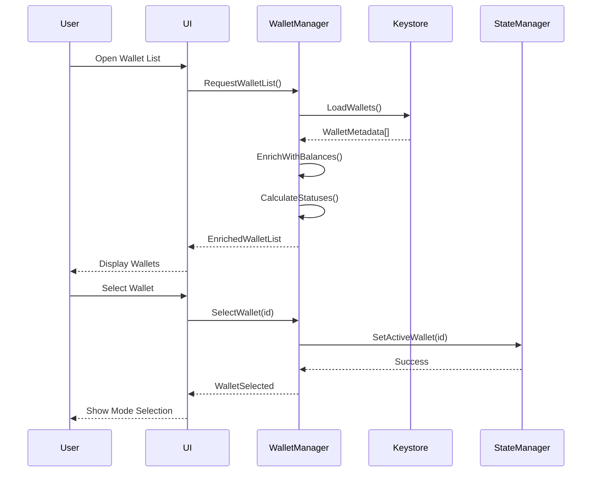
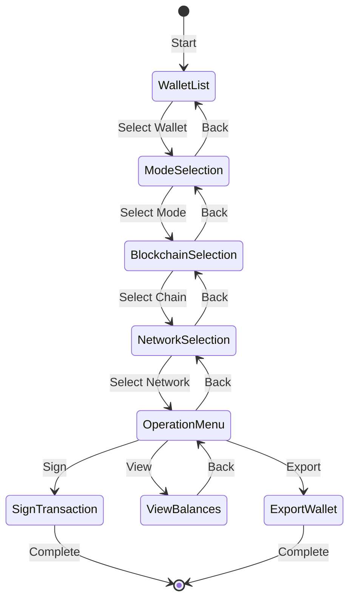
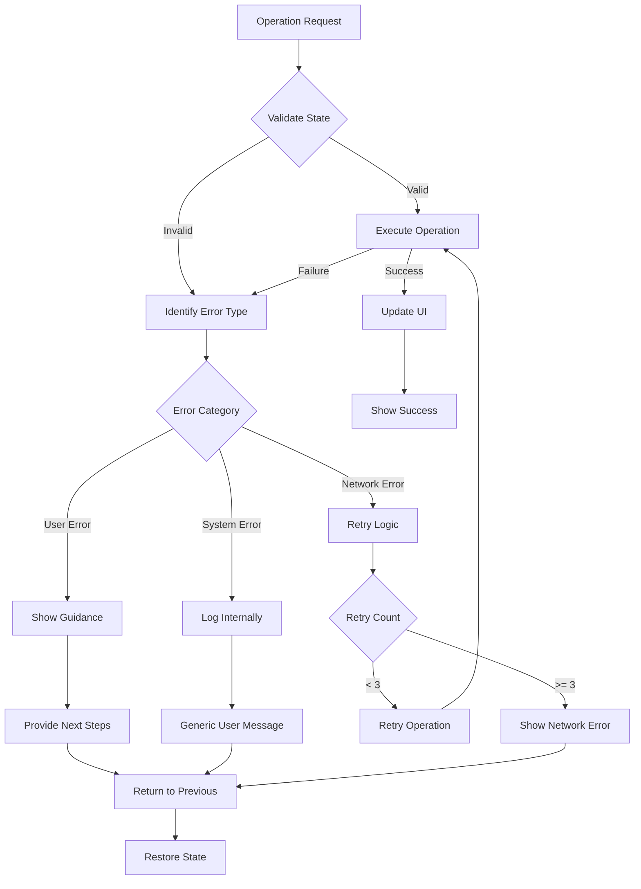

# FROST MPC Wallet Management System - Comprehensive Design Document

## Executive Summary

This document presents a complete redesign of the FROST MPC wallet management system, transforming it from a technical log-displaying interface into a professional, user-friendly terminal application. The new design implements a progressive selection workflow, proper state management, and clean separation between technical operations and user interaction.

### Key Improvements
- **Clean wallet list display** with comprehensive metadata and status indicators
- **Progressive selection flow**: Wallet → Mode → Blockchain → Network → Operation
- **No technical logs** in user-facing UI - all errors handled gracefully
- **Professional terminal interface** comparable to enterprise tools like BitGo
- **Multi-blockchain support** with automatic curve compatibility checking
- **Clear error handling** with actionable user messages

## Table of Contents

1. [System Architecture](#1-system-architecture)
2. [Data Flow Diagrams](#2-data-flow-diagrams)
3. [State Management Design](#3-state-management-design)
4. [Component Specifications](#4-component-specifications)
5. [API Contracts](#5-api-contracts)
6. [Error Handling Strategy](#6-error-handling-strategy)
7. [Testing Approach](#7-testing-approach)
8. [Migration Plan](#8-migration-plan)
9. [Implementation Roadmap](#9-implementation-roadmap)

---

## 1. System Architecture

### 1.1 Layered Architecture Overview

```
┌─────────────────────────────────────────────────────────────┐
│                    User Interface Layer                     │
│  ┌─────────────┐ ┌──────────┐ ┌─────────┐ ┌──────────┐   │
│  │ WalletList  │ │ ModeMenu │ │ ChainUI │ │ StatusBar│   │
│  │    View     │ │  Selector│ │ Selector│ │  Display │   │
│  └─────────────┘ └──────────┘ └─────────┘ └──────────┘   │
└─────────────────────────────────────────────────────────────┘
                              │
                              ▼
┌─────────────────────────────────────────────────────────────┐
│                  Wallet Management Layer                    │
│  ┌──────────────┐ ┌─────────────┐ ┌──────────────────┐   │
│  │WalletManager │ │ ModeHandler │ │ ChainCompatibility│   │
│  │   Service    │ │   Service   │ │     Service      │   │
│  └──────────────┘ └─────────────┘ └──────────────────┘   │
└─────────────────────────────────────────────────────────────┘
                              │
                              ▼
┌─────────────────────────────────────────────────────────────┐
│                     State Management Layer                  │
│  ┌──────────────┐ ┌─────────────┐ ┌──────────────────┐   │
│  │ WalletState  │ │ SessionState│ │  OperationState │   │
│  │   Manager    │ │   Manager   │ │     Manager      │   │
│  └──────────────┘ └─────────────┘ └──────────────────┘   │
└─────────────────────────────────────────────────────────────┘
                              │
                              ▼
┌─────────────────────────────────────────────────────────────┐
│                      Data Storage Layer                     │
│  ┌──────────────┐ ┌─────────────┐ ┌──────────────────┐   │
│  │  Keystore    │ │ Wallet      │ │   Blockchain     │   │
│  │  Repository  │ │ Repository  │ │   Repository     │   │
│  └──────────────┘ └─────────────┘ └──────────────────┘   │
└─────────────────────────────────────────────────────────────┘
                              │
                              ▼
┌─────────────────────────────────────────────────────────────┐
│                   Cryptographic Layer                       │
│  ┌──────────────┐ ┌─────────────┐ ┌──────────────────┐   │
│  │ FROST Core   │ │  WebRTC     │ │   Offline        │   │
│  │  Protocol    │ │  Network    │ │   SD Card I/O    │   │
│  └──────────────┘ └─────────────┘ └──────────────────┘   │
└─────────────────────────────────────────────────────────────┘
```

### 1.2 Core Components

#### WalletManager Service
- **Purpose**: Central orchestrator for all wallet operations
- **Responsibilities**:
  - Load and cache wallet metadata
  - Provide wallet list with enriched information
  - Handle wallet selection and validation
  - Coordinate with blockchain services for address generation

#### ModeHandler Service
- **Purpose**: Manage online/offline mode selection and transitions
- **Responsibilities**:
  - Validate mode availability based on wallet configuration
  - Handle mode-specific network setup
  - Coordinate WebRTC for online mode
  - Manage SD card operations for offline mode

#### ChainCompatibility Service
- **Purpose**: Ensure blockchain and curve compatibility
- **Responsibilities**:
  - Validate chain selection against wallet curve
  - Generate appropriate addresses for each chain
  - Provide network configuration for each blockchain
  - Handle multi-chain wallet operations

---

## 2. Data Flow Diagrams

### 2.1 Wallet Selection Flow



### 2.2 Progressive Selection Flow



### 2.3 Error Recovery Flow



---

## 3. State Management Design

### 3.1 State Structure

```rust
/// Root application state
pub struct WalletAppState {
    // Navigation State
    pub navigation: NavigationState,
    
    // Wallet State
    pub wallets: WalletListState,
    pub active_wallet: Option<ActiveWalletState>,
    
    // Operation State
    pub current_operation: Option<OperationState>,
    
    // UI State
    pub ui: UIState,
    
    // Error State
    pub error_queue: Vec<UserError>,
}

/// Navigation state for progressive flow
pub struct NavigationState {
    pub current_screen: Screen,
    pub navigation_stack: Vec<Screen>,
    pub can_go_back: bool,
}

/// Wallet list state
pub struct WalletListState {
    pub wallets: Vec<WalletSummary>,
    pub selected_index: usize,
    pub filter: WalletFilter,
    pub sort_by: WalletSortField,
    pub last_refresh: chrono::DateTime<Utc>,
}

/// Active wallet state
pub struct ActiveWalletState {
    pub wallet_id: String,
    pub metadata: WalletMetadata,
    pub mode: OperationMode,
    pub selected_chain: Option<BlockchainConfig>,
    pub selected_network: Option<NetworkConfig>,
    pub addresses: HashMap<String, AddressInfo>,
    pub balances: HashMap<String, Balance>,
}

/// Wallet summary for list display
pub struct WalletSummary {
    pub id: String,
    pub name: String,
    pub threshold: String,           // e.g., "2-of-3"
    pub curve: CurveType,
    pub created: chrono::DateTime<Utc>,
    pub last_used: Option<chrono::DateTime<Utc>>,
    pub status: WalletStatus,
    pub primary_chain: String,
    pub total_value_usd: Option<f64>,
}

/// Wallet status for visual indication
pub enum WalletStatus {
    Ready,               // Green - All systems operational
    Syncing,            // Yellow - Loading balances
    RequiresAttention,  // Orange - Pending signatures
    Offline,            // Gray - Offline mode only
    Error(String),      // Red - Configuration issue
}

/// Operation mode selection
pub enum OperationMode {
    Online {
        connection_status: ConnectionStatus,
        peers: Vec<PeerInfo>,
    },
    Offline {
        sd_card_status: SdCardStatus,
        pending_exports: usize,
    },
    Hybrid {
        online_available: bool,
        offline_available: bool,
    },
}
```

### 3.2 State Transitions

```rust
/// State transition handlers
impl WalletAppState {
    /// Handle wallet selection
    pub fn select_wallet(&mut self, wallet_id: String) -> Result<()> {
        // Load wallet metadata
        let wallet = self.load_wallet_metadata(&wallet_id)?;
        
        // Determine available modes
        let available_modes = self.get_available_modes(&wallet)?;
        
        // Update state
        self.active_wallet = Some(ActiveWalletState {
            wallet_id,
            metadata: wallet,
            mode: OperationMode::default(),
            selected_chain: None,
            selected_network: None,
            addresses: HashMap::new(),
            balances: HashMap::new(),
        });
        
        // Navigate to mode selection
        self.navigation.push(Screen::ModeSelection);
        
        Ok(())
    }
    
    /// Handle mode selection
    pub fn select_mode(&mut self, mode: OperationMode) -> Result<()> {
        let wallet = self.active_wallet.as_mut()
            .ok_or_else(|| Error::NoWalletSelected)?;
        
        wallet.mode = mode;
        
        // Load compatible chains
        self.load_compatible_chains()?;
        
        // Navigate to blockchain selection
        self.navigation.push(Screen::BlockchainSelection);
        
        Ok(())
    }
    
    /// Handle blockchain selection
    pub fn select_blockchain(&mut self, chain: String) -> Result<()> {
        let wallet = self.active_wallet.as_mut()
            .ok_or_else(|| Error::NoWalletSelected)?;
        
        // Validate compatibility
        self.validate_chain_compatibility(&wallet.metadata, &chain)?;
        
        // Load chain config
        let chain_config = self.load_blockchain_config(&chain)?;
        wallet.selected_chain = Some(chain_config);
        
        // Generate address for this chain
        let address = self.generate_address_for_chain(
            &wallet.metadata.group_public_key,
            &wallet.metadata.curve_type,
            &chain,
        )?;
        
        wallet.addresses.insert(chain.clone(), address);
        
        // Navigate to network selection
        self.navigation.push(Screen::NetworkSelection);
        
        Ok(())
    }
}
```

---

## 4. Component Specifications

### 4.1 Wallet List Component

```rust
/// Wallet list view component
pub struct WalletListView {
    /// Display configuration
    config: WalletListConfig,
    
    /// Current state
    state: WalletListState,
    
    /// Event handler
    on_select: Box<dyn Fn(String)>,
}

impl WalletListView {
    /// Render the wallet list
    pub fn render(&self, frame: &mut Frame, area: Rect) {
        // Header
        let header = self.render_header();
        
        // Wallet items
        let items: Vec<ListItem> = self.state.wallets
            .iter()
            .map(|wallet| self.render_wallet_item(wallet))
            .collect();
        
        // List widget
        let list = List::new(items)
            .block(Block::default()
                .title("💼 Your Wallets")
                .borders(Borders::ALL))
            .highlight_style(Style::default()
                .bg(Color::Blue)
                .fg(Color::White));
        
        frame.render_stateful_widget(list, area, &mut self.state);
    }
    
    /// Render individual wallet item
    fn render_wallet_item(&self, wallet: &WalletSummary) -> ListItem {
        let status_indicator = match wallet.status {
            WalletStatus::Ready => "🟢",
            WalletStatus::Syncing => "🟡",
            WalletStatus::RequiresAttention => "🟠",
            WalletStatus::Offline => "⚫",
            WalletStatus::Error(_) => "🔴",
        };
        
        let lines = vec![
            Line::from(vec![
                Span::raw(status_indicator),
                Span::raw(" "),
                Span::styled(
                    &wallet.name,
                    Style::default().add_modifier(Modifier::BOLD),
                ),
                Span::raw(" "),
                Span::styled(
                    format!("({})", wallet.threshold),
                    Style::default().fg(Color::Gray),
                ),
            ]),
            Line::from(vec![
                Span::raw("  "),
                Span::styled(
                    format!("{} • {}", wallet.curve, wallet.primary_chain),
                    Style::default().fg(Color::Gray),
                ),
            ]),
            if let Some(value) = wallet.total_value_usd {
                Line::from(vec![
                    Span::raw("  "),
                    Span::styled(
                        format!("${:.2}", value),
                        Style::default().fg(Color::Green),
                    ),
                ])
            } else {
                Line::from("")
            },
        ];
        
        ListItem::new(lines)
    }
}
```

### 4.2 Mode Selection Component

```rust
/// Mode selection menu
pub struct ModeSelectionView {
    wallet: ActiveWalletState,
    selected_index: usize,
}

impl ModeSelectionView {
    pub fn render(&self, frame: &mut Frame, area: Rect) {
        let modes = self.get_available_modes();
        
        let items: Vec<ListItem> = modes
            .iter()
            .enumerate()
            .map(|(i, mode)| self.render_mode_item(mode, i == self.selected_index))
            .collect();
        
        let list = List::new(items)
            .block(Block::default()
                .title(format!("🔐 Select Mode for {}", self.wallet.metadata.name))
                .borders(Borders::ALL));
        
        frame.render_widget(list, area);
    }
    
    fn render_mode_item(&self, mode: &ModeOption, selected: bool) -> ListItem {
        let (icon, title, description, status) = match mode {
            ModeOption::Online { available } => (
                "🌐",
                "Online Mode",
                "Real-time coordination via WebRTC",
                if *available { "Available" } else { "Not Available" },
            ),
            ModeOption::Offline { sd_card_present } => (
                "💾",
                "Offline Mode",
                "Air-gapped security via SD card",
                if *sd_card_present { "SD Card Ready" } else { "Insert SD Card" },
            ),
            ModeOption::Hybrid => (
                "🔄",
                "Hybrid Mode",
                "Online coordination, offline signing",
                "Available",
            ),
        };
        
        let style = if selected {
            Style::default().bg(Color::Blue).fg(Color::White)
        } else {
            Style::default()
        };
        
        ListItem::new(vec![
            Line::from(vec![
                Span::styled(format!("{} {}", icon, title), style.add_modifier(Modifier::BOLD)),
                Span::raw(" "),
                Span::styled(format!("[{}]", status), style.fg(Color::Gray)),
            ]),
            Line::from(vec![
                Span::styled(format!("   {}", description), style),
            ]),
        ])
    }
}
```

### 4.3 Blockchain Selection Component

```rust
/// Blockchain selection view
pub struct BlockchainSelectionView {
    wallet: ActiveWalletState,
    compatible_chains: Vec<BlockchainInfo>,
    selected_index: usize,
}

impl BlockchainSelectionView {
    pub fn render(&self, frame: &mut Frame, area: Rect) {
        // Group chains by compatibility
        let (compatible, incompatible) = self.partition_chains();
        
        // Render sections
        let chunks = Layout::default()
            .direction(Direction::Vertical)
            .constraints([
                Constraint::Percentage(60), // Compatible chains
                Constraint::Percentage(40), // Incompatible chains (grayed out)
            ])
            .split(area);
        
        self.render_compatible_chains(frame, chunks[0], &compatible);
        self.render_incompatible_chains(frame, chunks[1], &incompatible);
    }
    
    fn render_compatible_chains(
        &self,
        frame: &mut Frame,
        area: Rect,
        chains: &[BlockchainInfo],
    ) {
        let items: Vec<ListItem> = chains
            .iter()
            .enumerate()
            .map(|(i, chain)| {
                let selected = i == self.selected_index;
                self.render_chain_item(chain, selected, true)
            })
            .collect();
        
        let list = List::new(items)
            .block(Block::default()
                .title(format!(
                    "✅ Compatible Blockchains ({})",
                    self.wallet.metadata.curve_type
                ))
                .borders(Borders::ALL));
        
        frame.render_widget(list, area);
    }
    
    fn render_chain_item(
        &self,
        chain: &BlockchainInfo,
        selected: bool,
        compatible: bool,
    ) -> ListItem {
        let style = if !compatible {
            Style::default().fg(Color::DarkGray)
        } else if selected {
            Style::default().bg(Color::Green).fg(Color::White)
        } else {
            Style::default()
        };
        
        let status = if compatible {
            "✓ Compatible"
        } else {
            format!("✗ Requires {}", chain.required_curve).as_str()
        };
        
        ListItem::new(vec![
            Line::from(vec![
                Span::styled(
                    format!("{} {}", chain.icon, chain.name),
                    style.add_modifier(Modifier::BOLD),
                ),
                Span::raw(" "),
                Span::styled(
                    format!("({})", chain.symbol),
                    style.fg(Color::Gray),
                ),
            ]),
            Line::from(vec![
                Span::raw("  "),
                Span::styled(status, style),
            ]),
        ])
    }
}
```

---

## 5. API Contracts

### 5.1 Internal Command API

```rust
/// Enhanced internal commands for wallet management
pub enum WalletCommand<C: Ciphersuite> {
    // Wallet List Operations
    LoadWalletList,
    RefreshWalletList,
    SelectWallet { wallet_id: String },
    
    // Mode Selection
    SelectMode { mode: OperationMode },
    ValidateModeAvailability,
    
    // Blockchain Operations
    SelectBlockchain { chain: String },
    SelectNetwork { network: String },
    GenerateAddress { chain: String },
    
    // Wallet Operations
    InitiateSignature {
        wallet_id: String,
        chain: String,
        network: String,
        transaction: Transaction,
    },
    ExportWallet {
        wallet_id: String,
        format: ExportFormat,
    },
    RefreshBalances {
        wallet_id: String,
        chains: Vec<String>,
    },
    
    // Navigation
    NavigateBack,
    NavigateTo { screen: Screen },
}
```

### 5.2 Service Interfaces

```rust
/// Wallet manager service interface
#[async_trait]
pub trait WalletManagerService {
    /// Load all wallets with metadata
    async fn load_wallets(&self) -> Result<Vec<WalletSummary>>;
    
    /// Get detailed wallet information
    async fn get_wallet_details(&self, wallet_id: &str) -> Result<WalletDetails>;
    
    /// Generate address for a blockchain
    async fn generate_address(
        &self,
        wallet: &WalletMetadata,
        chain: &str,
    ) -> Result<AddressInfo>;
    
    /// Get wallet balances
    async fn get_balances(
        &self,
        wallet_id: &str,
        chains: Vec<String>,
    ) -> Result<HashMap<String, Balance>>;
}

/// Mode handler service interface
#[async_trait]
pub trait ModeHandlerService {
    /// Get available modes for a wallet
    async fn get_available_modes(
        &self,
        wallet: &WalletMetadata,
    ) -> Result<Vec<ModeOption>>;
    
    /// Initialize mode-specific resources
    async fn initialize_mode(
        &self,
        mode: &OperationMode,
    ) -> Result<ModeContext>;
    
    /// Cleanup mode resources
    async fn cleanup_mode(&self, mode: &OperationMode) -> Result<()>;
}

/// Chain compatibility service interface
#[async_trait]
pub trait ChainCompatibilityService {
    /// Get compatible chains for a curve type
    async fn get_compatible_chains(
        &self,
        curve: &CurveType,
    ) -> Result<Vec<BlockchainInfo>>;
    
    /// Validate chain compatibility
    async fn validate_compatibility(
        &self,
        curve: &CurveType,
        chain: &str,
    ) -> Result<bool>;
    
    /// Get network configurations for a chain
    async fn get_networks(
        &self,
        chain: &str,
    ) -> Result<Vec<NetworkConfig>>;
}
```

### 5.3 Event System

```rust
/// UI events for wallet management
pub enum WalletUIEvent {
    // User interactions
    WalletSelected { wallet_id: String },
    ModeSelected { mode: OperationMode },
    BlockchainSelected { chain: String },
    NetworkSelected { network: String },
    OperationRequested { operation: WalletOperation },
    
    // System events
    WalletsLoaded { wallets: Vec<WalletSummary> },
    BalancesUpdated { balances: HashMap<String, Balance> },
    AddressGenerated { chain: String, address: String },
    
    // Error events
    ErrorOccurred { error: UserError },
    WarningRaised { warning: UserWarning },
}

/// Event handler trait
#[async_trait]
pub trait EventHandler {
    async fn handle_event(&mut self, event: WalletUIEvent) -> Result<()>;
}
```

---

## 6. Error Handling Strategy

### 6.1 Error Categories and User Messages

```rust
/// User-friendly error types
pub enum UserError {
    // Configuration errors
    WalletNotFound {
        wallet_id: String,
        suggestion: String,
    },
    IncompatibleCurve {
        wallet_curve: String,
        chain: String,
        required_curve: String,
        suggestion: String,
    },
    
    // Network errors
    ConnectionFailed {
        reason: String,
        retry_available: bool,
        fallback_suggestion: String,
    },
    PeerUnavailable {
        peer_id: String,
        required_peers: usize,
        available_peers: usize,
        suggestion: String,
    },
    
    // Operation errors
    InsufficientSignatures {
        required: usize,
        available: usize,
        missing_peers: Vec<String>,
        suggestion: String,
    },
    
    // Storage errors
    KeystoreAccessFailed {
        path: String,
        reason: String,
        suggestion: String,
    },
}

impl UserError {
    /// Get user-friendly error message
    pub fn user_message(&self) -> String {
        match self {
            UserError::WalletNotFound { wallet_id, suggestion } => {
                format!(
                    "Wallet '{}' not found.\n💡 {}",
                    wallet_id, suggestion
                )
            }
            UserError::IncompatibleCurve { wallet_curve, chain, required_curve, suggestion } => {
                format!(
                    "{} requires {} curve, but this wallet uses {}.\n💡 {}",
                    chain, required_curve, wallet_curve, suggestion
                )
            }
            UserError::ConnectionFailed { reason, retry_available, fallback_suggestion } => {
                if *retry_available {
                    format!(
                        "Connection failed: {}\n🔄 Press 'r' to retry or 'o' for offline mode.\n💡 {}",
                        reason, fallback_suggestion
                    )
                } else {
                    format!(
                        "Connection failed: {}\n💡 {}",
                        reason, fallback_suggestion
                    )
                }
            }
            _ => self.default_message(),
        }
    }
    
    /// Get recovery actions
    pub fn recovery_actions(&self) -> Vec<RecoveryAction> {
        match self {
            UserError::ConnectionFailed { retry_available, .. } => {
                let mut actions = vec![RecoveryAction::GoBack];
                if *retry_available {
                    actions.insert(0, RecoveryAction::Retry);
                }
                actions.push(RecoveryAction::SwitchToOfflineMode);
                actions
            }
            UserError::IncompatibleCurve { .. } => {
                vec![
                    RecoveryAction::SelectDifferentChain,
                    RecoveryAction::GoBack,
                ]
            }
            _ => vec![RecoveryAction::GoBack],
        }
    }
}
```

### 6.2 Error Display Component

```rust
/// Error display overlay
pub struct ErrorOverlay {
    error: Option<UserError>,
    selected_action: usize,
}

impl ErrorOverlay {
    pub fn render(&self, frame: &mut Frame, area: Rect) {
        if let Some(error) = &self.error {
            // Create centered popup
            let popup = centered_rect(70, 40, area);
            frame.render_widget(Clear, popup);
            
            // Error block with appropriate color
            let block = Block::default()
                .title("⚠️ Error")
                .borders(Borders::ALL)
                .border_style(Style::default().fg(Color::Red));
            
            let inner = block.inner(popup);
            frame.render_widget(block, popup);
            
            // Layout for error content
            let chunks = Layout::default()
                .direction(Direction::Vertical)
                .constraints([
                    Constraint::Min(5),      // Error message
                    Constraint::Length(3),   // Recovery actions
                ])
                .split(inner);
            
            // Error message
            let message = Paragraph::new(error.user_message())
                .wrap(Wrap { trim: true })
                .style(Style::default().fg(Color::White));
            frame.render_widget(message, chunks[0]);
            
            // Recovery actions
            let actions = error.recovery_actions();
            let action_text = actions
                .iter()
                .enumerate()
                .map(|(i, action)| {
                    let prefix = if i == self.selected_action { "▶ " } else { "  " };
                    format!("{}{}", prefix, action.display_text())
                })
                .collect::<Vec<_>>()
                .join("  ");
            
            let actions_widget = Paragraph::new(action_text)
                .style(Style::default().fg(Color::Yellow))
                .alignment(Alignment::Center);
            frame.render_widget(actions_widget, chunks[1]);
        }
    }
}
```

---

## 7. Testing Approach

### 7.1 Unit Testing Strategy

```rust
#[cfg(test)]
mod wallet_manager_tests {
    use super::*;
    
    #[tokio::test]
    async fn test_load_wallets_with_enrichment() {
        // Setup
        let keystore = MockKeystore::new();
        keystore.add_wallet(create_test_wallet("wallet1", "secp256k1"));
        keystore.add_wallet(create_test_wallet("wallet2", "ed25519"));
        
        let manager = WalletManager::new(keystore);
        
        // Execute
        let wallets = manager.load_wallets().await.unwrap();
        
        // Verify
        assert_eq!(wallets.len(), 2);
        assert_eq!(wallets[0].status, WalletStatus::Ready);
        assert!(wallets[0].threshold.contains("of"));
    }
    
    #[tokio::test]
    async fn test_chain_compatibility_validation() {
        let service = ChainCompatibilityService::new();
        
        // Test secp256k1 compatibility
        assert!(service.validate_compatibility(
            &CurveType::Secp256k1,
            "ethereum"
        ).await.unwrap());
        
        assert!(!service.validate_compatibility(
            &CurveType::Secp256k1,
            "solana"
        ).await.unwrap());
        
        // Test ed25519 compatibility
        assert!(service.validate_compatibility(
            &CurveType::Ed25519,
            "solana"
        ).await.unwrap());
        
        assert!(!service.validate_compatibility(
            &CurveType::Ed25519,
            "ethereum"
        ).await.unwrap());
    }
    
    #[test]
    fn test_error_message_generation() {
        let error = UserError::IncompatibleCurve {
            wallet_curve: "secp256k1".to_string(),
            chain: "Solana".to_string(),
            required_curve: "ed25519".to_string(),
            suggestion: "Select an Ethereum-compatible chain instead".to_string(),
        };
        
        let message = error.user_message();
        assert!(message.contains("Solana requires ed25519"));
        assert!(message.contains("💡"));
        assert!(!message.contains("Error"));  // No technical terms
    }
}
```

### 7.2 Integration Testing

```rust
#[cfg(test)]
mod integration_tests {
    use super::*;
    
    #[tokio::test]
    async fn test_complete_wallet_selection_flow() {
        // Setup
        let app = create_test_app();
        let wallet_id = "test-wallet-123";
        
        // Step 1: Load wallet list
        app.handle_command(WalletCommand::LoadWalletList).await.unwrap();
        assert_eq!(app.state.navigation.current_screen, Screen::WalletList);
        
        // Step 2: Select wallet
        app.handle_command(WalletCommand::SelectWallet {
            wallet_id: wallet_id.to_string(),
        }).await.unwrap();
        assert_eq!(app.state.navigation.current_screen, Screen::ModeSelection);
        assert!(app.state.active_wallet.is_some());
        
        // Step 3: Select mode
        app.handle_command(WalletCommand::SelectMode {
            mode: OperationMode::Online { 
                connection_status: ConnectionStatus::Connected,
                peers: vec![],
            },
        }).await.unwrap();
        assert_eq!(app.state.navigation.current_screen, Screen::BlockchainSelection);
        
        // Step 4: Select blockchain
        app.handle_command(WalletCommand::SelectBlockchain {
            chain: "ethereum".to_string(),
        }).await.unwrap();
        assert_eq!(app.state.navigation.current_screen, Screen::NetworkSelection);
        
        // Verify state consistency
        let wallet = app.state.active_wallet.as_ref().unwrap();
        assert!(wallet.addresses.contains_key("ethereum"));
        assert_eq!(wallet.selected_chain.as_ref().unwrap().name, "ethereum");
    }
    
    #[tokio::test]
    async fn test_error_recovery_flow() {
        let app = create_test_app();
        
        // Attempt to select incompatible chain
        app.state.active_wallet = Some(ActiveWalletState {
            metadata: create_test_wallet("test", "secp256k1"),
            ..Default::default()
        });
        
        let result = app.handle_command(WalletCommand::SelectBlockchain {
            chain: "solana".to_string(),
        }).await;
        
        // Verify error is user-friendly
        assert!(result.is_err());
        let error = result.unwrap_err();
        assert!(matches!(error, UserError::IncompatibleCurve { .. }));
        
        // Verify recovery actions available
        let actions = error.recovery_actions();
        assert!(actions.contains(&RecoveryAction::SelectDifferentChain));
    }
}
```

### 7.3 UI Component Testing

```rust
#[cfg(test)]
mod ui_tests {
    use super::*;
    use ratatui::backend::TestBackend;
    
    #[test]
    fn test_wallet_list_rendering() {
        let backend = TestBackend::new(80, 24);
        let mut terminal = Terminal::new(backend).unwrap();
        
        let wallets = vec![
            WalletSummary {
                id: "wallet1".to_string(),
                name: "Trading Wallet".to_string(),
                threshold: "2-of-3".to_string(),
                curve: CurveType::Secp256k1,
                status: WalletStatus::Ready,
                primary_chain: "Ethereum".to_string(),
                total_value_usd: Some(10000.50),
                ..Default::default()
            },
        ];
        
        let view = WalletListView::new(wallets);
        
        terminal.draw(|f| {
            view.render(f, f.area());
        }).unwrap();
        
        // Verify rendering
        let buffer = terminal.backend().buffer();
        let content = buffer_to_string(buffer);
        
        assert!(content.contains("💼 Your Wallets"));
        assert!(content.contains("Trading Wallet"));
        assert!(content.contains("2-of-3"));
        assert!(content.contains("$10000.50"));
        assert!(content.contains("🟢"));  // Ready status
    }
    
    #[test]
    fn test_error_overlay_rendering() {
        let backend = TestBackend::new(80, 24);
        let mut terminal = Terminal::new(backend).unwrap();
        
        let error = UserError::ConnectionFailed {
            reason: "Network timeout".to_string(),
            retry_available: true,
            fallback_suggestion: "Try offline mode for local operations".to_string(),
        };
        
        let overlay = ErrorOverlay::new(Some(error));
        
        terminal.draw(|f| {
            overlay.render(f, f.area());
        }).unwrap();
        
        let buffer = terminal.backend().buffer();
        let content = buffer_to_string(buffer);
        
        assert!(content.contains("⚠️ Error"));
        assert!(content.contains("Connection failed"));
        assert!(content.contains("Press 'r' to retry"));
        assert!(content.contains("💡"));
    }
}
```

---

## 8. Migration Plan

### 8.1 Phase 1: Backend Preparation (Week 1)

#### Tasks:
1. **Implement WalletManager Service**
   - Create service structure
   - Implement wallet loading and caching
   - Add enrichment logic for balances and status

2. **Implement ChainCompatibilityService**
   - Create compatibility matrix
   - Implement validation logic
   - Add address generation per chain

3. **Update State Management**
   - Migrate to new state structure
   - Add navigation state management
   - Implement state persistence

#### Verification:
- Unit tests pass for all services
- Existing functionality not broken
- State migrations tested

### 8.2 Phase 2: UI Component Development (Week 2)

#### Tasks:
1. **Build New UI Components**
   - WalletListView with status indicators
   - ModeSelectionView with availability checks
   - BlockchainSelectionView with compatibility
   - NetworkSelectionView
   - ErrorOverlay component

2. **Implement Progressive Flow**
   - Navigation controller
   - Screen transition logic
   - Back navigation support

3. **Remove Technical Logs from UI**
   - Create separate debug view (developer mode only)
   - Implement user-friendly status messages
   - Add progress indicators

#### Verification:
- UI components render correctly
- Navigation flows work end-to-end
- No technical jargon in user messages

### 8.3 Phase 3: Integration and Polish (Week 3)

#### Tasks:
1. **Service Integration**
   - Connect UI to backend services
   - Implement event handling
   - Add real-time updates

2. **Error Handling Implementation**
   - Add error recovery flows
   - Implement retry logic
   - Add fallback options

3. **Performance Optimization**
   - Implement lazy loading for wallet list
   - Add caching for blockchain data
   - Optimize rendering performance

#### Verification:
- Integration tests pass
- Error scenarios handled gracefully
- Performance benchmarks met

### 8.4 Phase 4: Testing and Documentation (Week 4)

#### Tasks:
1. **Comprehensive Testing**
   - Unit tests for all components
   - Integration tests for flows
   - User acceptance testing

2. **Documentation Updates**
   - Update user guides
   - Create troubleshooting guide
   - Document new architecture

3. **Migration Support**
   - Create migration scripts if needed
   - Test upgrade path
   - Prepare rollback plan

#### Verification:
- All tests passing
- Documentation complete
- Migration tested on staging

---

## 9. Implementation Roadmap

### 9.1 Immediate Actions (Day 1-3)

```rust
// Step 1: Create new module structure
mod wallet_management {
    pub mod services;
    pub mod state;
    pub mod ui;
    pub mod errors;
}

// Step 2: Implement core services
impl WalletManagerService {
    pub async fn new(keystore_path: PathBuf) -> Result<Self> {
        // Implementation
    }
}

// Step 3: Update app_runner.rs
impl AppRunner {
    pub fn initialize_wallet_manager(&mut self) -> Result<()> {
        self.wallet_manager = Some(WalletManagerService::new(
            self.keystore_path.clone()
        ).await?);
        Ok(())
    }
}
```

### 9.2 Short-term Goals (Week 1-2)

1. **Replace current wallet list display**
   - Remove technical logging
   - Add wallet status indicators
   - Implement sorting and filtering

2. **Implement mode selection**
   - Check network availability
   - Validate SD card presence
   - Show clear mode descriptions

3. **Add blockchain compatibility**
   - Validate curve requirements
   - Show compatible/incompatible chains
   - Generate correct addresses

### 9.3 Medium-term Goals (Week 3-4)

1. **Complete progressive flow**
   - Wallet → Mode → Chain → Network → Operation
   - Smooth transitions between screens
   - Consistent back navigation

2. **Enhance error handling**
   - User-friendly messages
   - Recovery suggestions
   - Retry mechanisms

3. **Add quality-of-life features**
   - Search/filter wallets
   - Favorite wallets
   - Recent operations

### 9.4 Long-term Vision (Month 2+)

1. **Advanced Features**
   - Wallet grouping/folders
   - Custom wallet icons
   - Operation history
   - Export/Import improvements

2. **Performance Enhancements**
   - Background balance updates
   - Predictive loading
   - Optimistic UI updates

3. **Enterprise Features**
   - Audit logs
   - Compliance reports
   - Multi-user support
   - Role-based access

---

## Conclusion

This comprehensive design document provides a complete blueprint for transforming the FROST MPC wallet management system into a professional, user-friendly application. The design emphasizes:

1. **Clean separation** between technical operations and user interface
2. **Progressive workflow** that guides users through complex operations
3. **Robust error handling** with user-friendly messages and recovery options
4. **Professional presentation** comparable to enterprise wallet solutions
5. **Comprehensive testing** to ensure reliability and maintainability

By following this design, the wallet management system will provide users with a clear, intuitive interface while maintaining the security and reliability expected of a professional MPC wallet solution.

---

## Appendices

### A. Blockchain Compatibility Matrix

| Blockchain | Required Curve | Network Options | Chain IDs |
|------------|---------------|-----------------|-----------|
| Ethereum | secp256k1 | Mainnet, Goerli, Sepolia | 1, 5, 11155111 |
| Bitcoin | secp256k1 | Mainnet, Testnet | N/A |
| BSC | secp256k1 | Mainnet, Testnet | 56, 97 |
| Polygon | secp256k1 | Mainnet, Mumbai | 137, 80001 |
| Avalanche | secp256k1 | C-Chain, Fuji | 43114, 43113 |
| Solana | ed25519 | Mainnet, Devnet, Testnet | N/A |
| Sui | ed25519 | Mainnet, Testnet | N/A |
| Aptos | ed25519 | Mainnet, Testnet | N/A |
| Near | ed25519 | Mainnet, Testnet | N/A |

### B. Status Indicator Meanings

| Indicator | Status | Description |
|-----------|--------|-------------|
| 🟢 | Ready | Wallet fully operational, all services available |
| 🟡 | Syncing | Loading balances or updating blockchain data |
| 🟠 | Attention Required | Pending signatures or actions needed |
| ⚫ | Offline Only | Wallet configured for offline mode only |
| 🔴 | Error | Configuration issue or critical error |

### C. User Message Templates

```rust
// Success messages
"✅ Wallet selected successfully"
"✅ Address generated for {chain}"
"✅ Transaction signed and broadcast"

// Information messages
"ℹ️ Loading wallet information..."
"ℹ️ Connecting to {peer_count} participants"
"ℹ️ Generating address for {chain}"

// Warning messages
"⚠️ Network connection unstable"
"⚠️ Some participants offline ({count}/{total})"
"⚠️ SD card not detected for offline mode"

// Error messages with suggestions
"❌ Cannot connect to network
💡 Check your internet connection or switch to offline mode"

"❌ Incompatible blockchain selected
💡 This wallet supports: {compatible_chains}"

"❌ Insufficient signatures ({current}/{required})
💡 Wait for more participants to sign"
```

### D. File Structure

```
apps/tui-node/src/
├── wallet_management/
│   ├── mod.rs
│   ├── services/
│   │   ├── mod.rs
│   │   ├── wallet_manager.rs
│   │   ├── mode_handler.rs
│   │   └── chain_compatibility.rs
│   ├── state/
│   │   ├── mod.rs
│   │   ├── app_state.rs
│   │   ├── navigation.rs
│   │   └── wallet_state.rs
│   ├── ui/
│   │   ├── mod.rs
│   │   ├── wallet_list.rs
│   │   ├── mode_selection.rs
│   │   ├── blockchain_selection.rs
│   │   ├── network_selection.rs
│   │   └── error_overlay.rs
│   └── errors/
│       ├── mod.rs
│       ├── user_errors.rs
│       └── recovery.rs
└── (existing files...)
```

---

*End of Design Document*